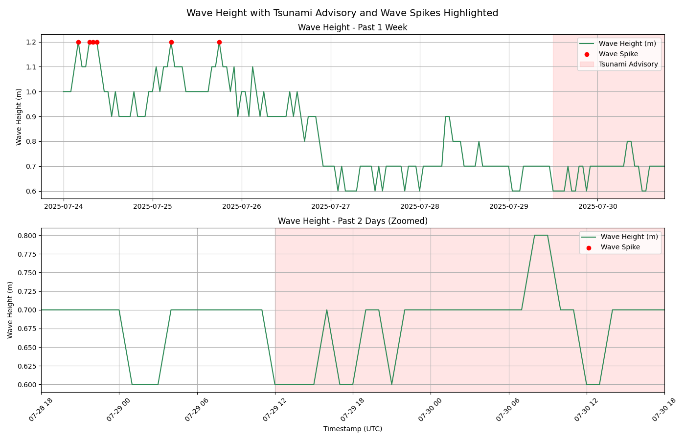

This project simulates coastal microclimate conditions near **Torrey Pines**, a scenic stretch of Southern California coastline known for steep cliffs, persistent marine layers, and dynamic tides.

   
  <i>Early-stage visualization: Torrey Sines</i>

   
  <i>Wave height observations at La Jolla during the week leading up to and including the tsunami advisory period (July 29–31, 2025). The top panel shows wave height over the past 7 days, while the bottom panel zooms in on the past 2 days. The shaded red region represents the tsunami advisory window, and red dots mark wave “spikes” (values > 2 σ above the mean). While the advisory was issued as a precaution after a large, distant earthquake in Russia (which had the potential to generate trans-Pacific tsunami waves), local observations show that wave heights remained at baseline levels (0.6–0.8 m) throughout the advisory period, with no anomalous surges or drawdowns typically associated with tsunami arrival.</i>

---

## Features

- Pulls hourly tide predictions from NOAA (La Jolla / Scripps Pier)
- Animates wave-tide interactions and sea surface color to reflect environmental change
- Modular architecture with reusable scripts for data fetching, interpolation, and visualization

---

## Data Sources

- Tide Height — from NOAA CO-OPS Station [`9410230`](https://tidesandcurrents.noaa.gov/stationhome.html?id=9410230) (La Jolla / Scripps Pier)
- Wave Height — from NOAA NDBC Buoy [`46225`](https://www.ndbc.noaa.gov/station_page.php?station=46225) (Torrey Pines Outer)
- Sea Temperature — via supplemental historical datasets, interpolated hourly 

Data was merged on timestamp using `pandas.merge_asof()` to align wave, tide, and temperature readings to an hourly cadence. All time series were cleaned and standardized to UTC.

---
## Visualization Concept

The ocean surface was modeled as a 3D sine wave traveling across the beach’s cross-section, with time-based updates to simulate natural ocean motion.

- X-axis: Width of the beach/ocean  
- Y-axis: Offshore distance (wave direction)  
- Z-axis: Combined water elevation = `tide + wave * sin(...)`

To animate the surface, `matplotlib.animation.FuncAnimation`was used, updating the Z-values frame by frame to simulate a rolling tide and traveling wave crests.

---

## Key Visual Components

- Wave amplitude dynamically scales with wave height  
- Vertical offset tracks real-time tide height  
- Color encoding reflects sea temperature using a custom blue-to-teal gradient:
  - Cooler: Deep indigo/navy  
  - Warmer: Aqua/teal

---

## Challenges & Refinements

- NOAA buoy data required custom parsing to handle inconsistent headers and `'MM'` (missing) fields  
- Updating the surface in 3D required calling `.remove()` on previous plots to avoid wiping the time HUD  
- Spacing adjustments along the X-axis and fine-tuning of sine frequency were essential to make wave crests appear more natural
